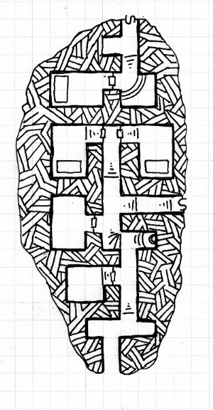

This is my take on the one-shot [Burial Mound of Esur the Red](https://dysonlogos.blog/2009/07/24/friday-map-burial-mound-of-esur-the-red/) from [Dyson's Dodecahedron blog](https://dysonlogos.blog/) - posted on July 24th 2009

There's technically two maps - The real tomb isn't connected to the false tomb so I made it two separate maps so they players won't see it on the board in front of them.   Additionally I didn't make it multi-level so no stairs up or down.  There's also a bunch of spots where the tiles didn't map out perfectly so I have a wall tile in backwards or the like.  I also put a door floating in space for use if they find the secret exit/entrance half way down the map. 

The map this is based on:

The "false tomb" portion:

The "real tomb" portion:

