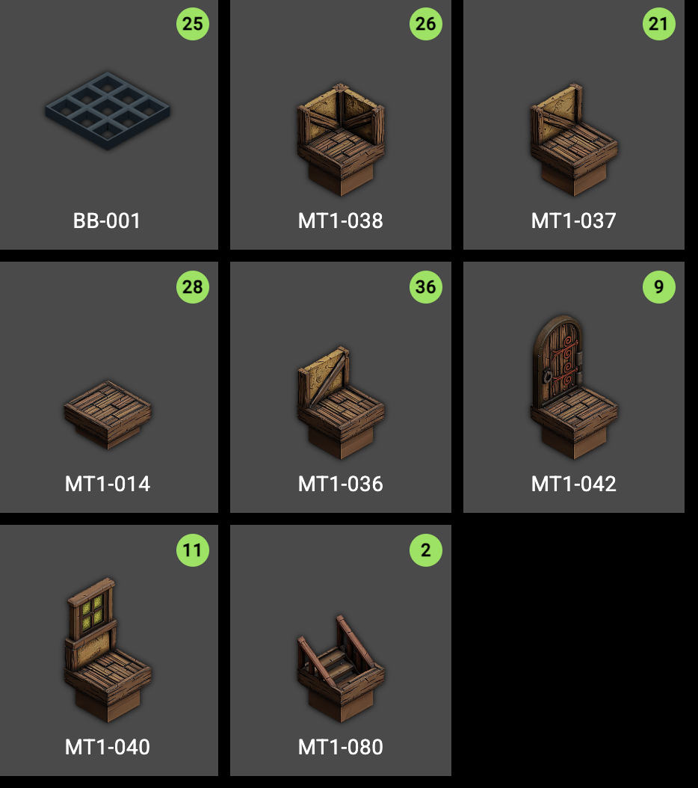

My build of the 2nd floor of the adventure Trash Gremlins by DMDave.

[Trash Gremlins on Patreon](https://www.patreon.com/posts/trash-gremlins-45111227)

Some build notes: - I chose to not do back to back walls opting instead to have the walls be single sided.  To put it another way the block forms the wall inside and outside the room.  Here's a [Reddit post where I asked about what others do](https://www.reddit.com/r/DungeonBlocks/comments/1p3fp4a/did_my_first_test_fit_of_my_first_layout/) here. 

The build uses [THE MEDIEVAL TOWN Part.1](https://www.myminifactory.com/object/3d-print-the-medieval-town-part-1-dungeon-blocks-342512)

Additonally I mixed in two half-wall types for all walls:

* MT1-036 qty 21
* MT1-037 qty 36

Both were used used haphazardly - you could also just use MT1-035 depending on the aesthetic you want to have. In the end you need 57 short walls of any of those three types.

There are a few places where the walls don't align perfectly.  This was a deliberate choice to minimize tiles.  You can easily modify 

The build list 
