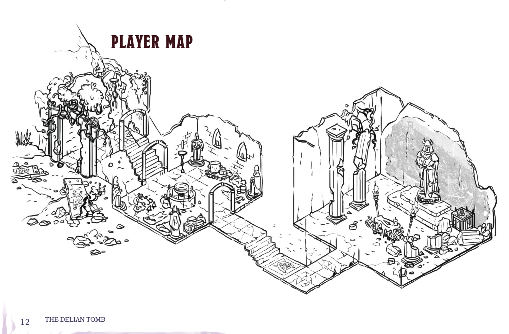
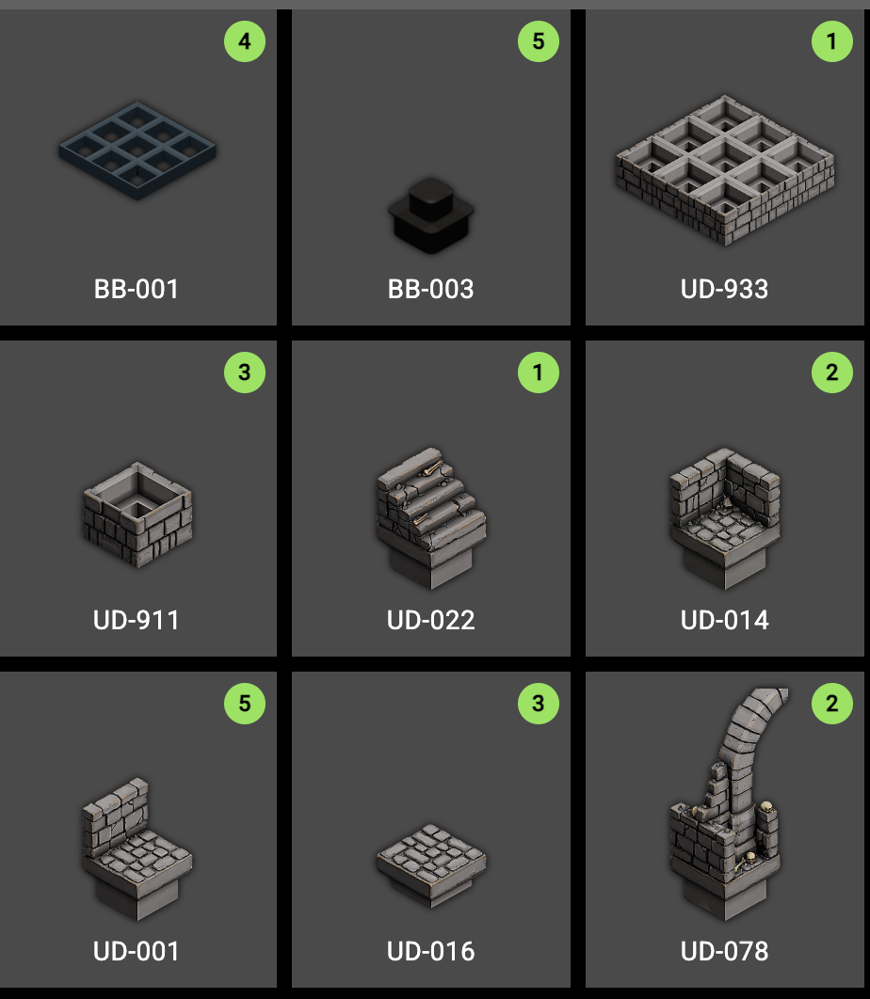
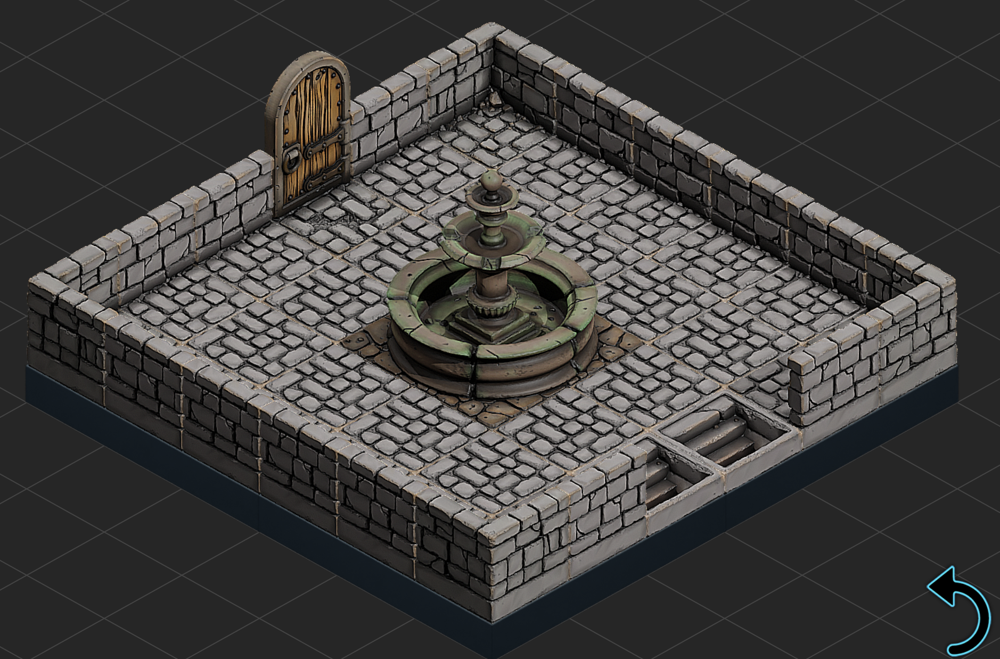
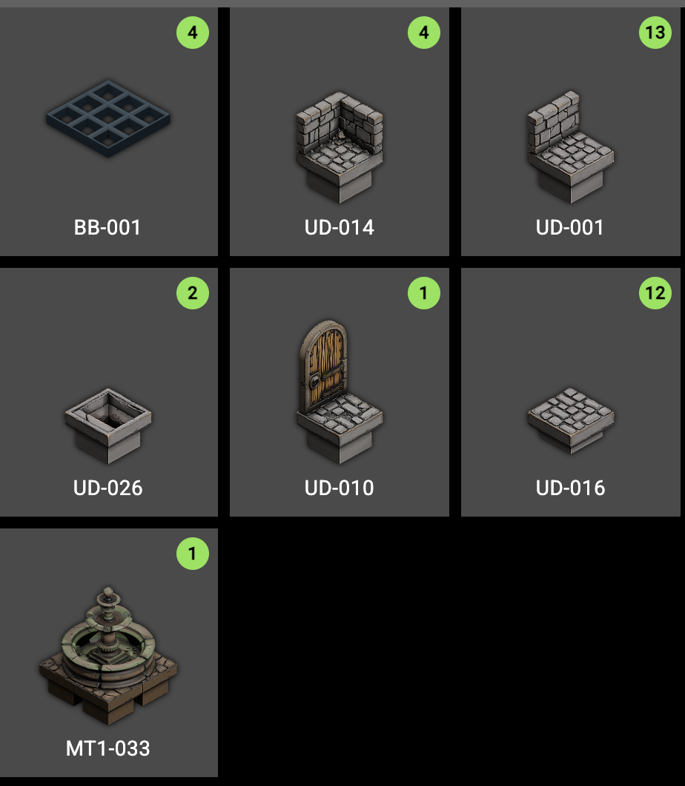
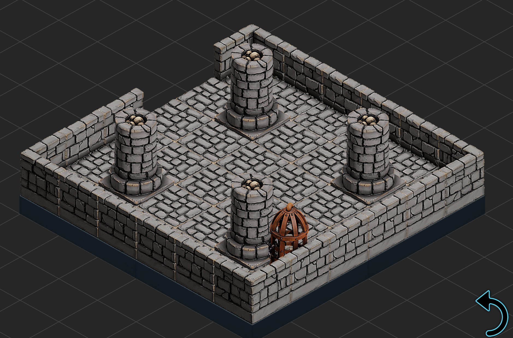
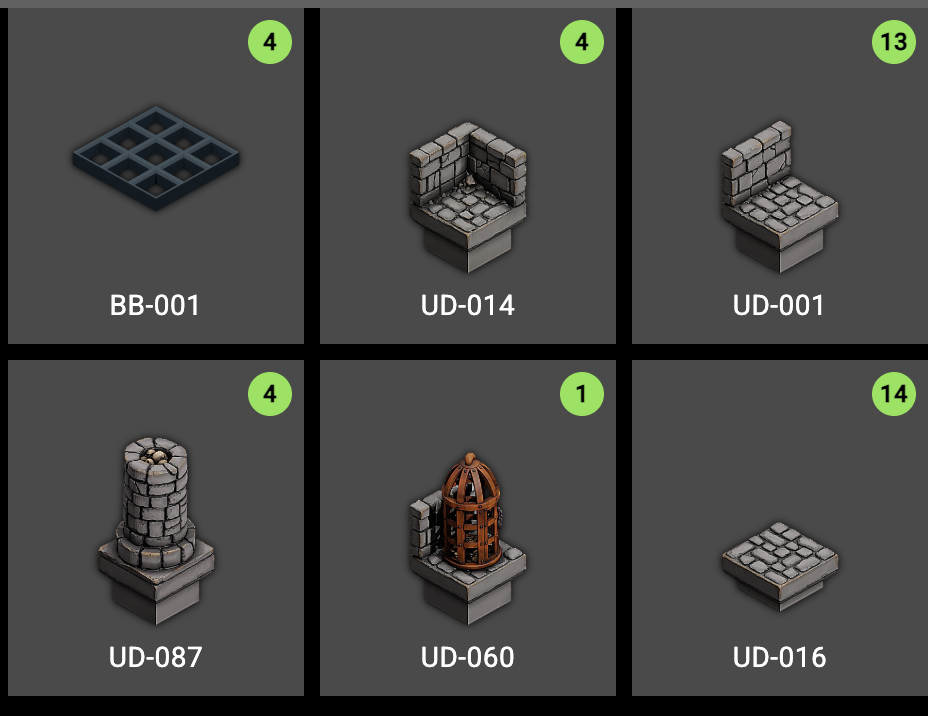
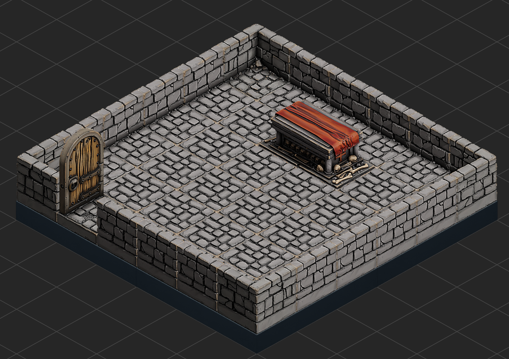
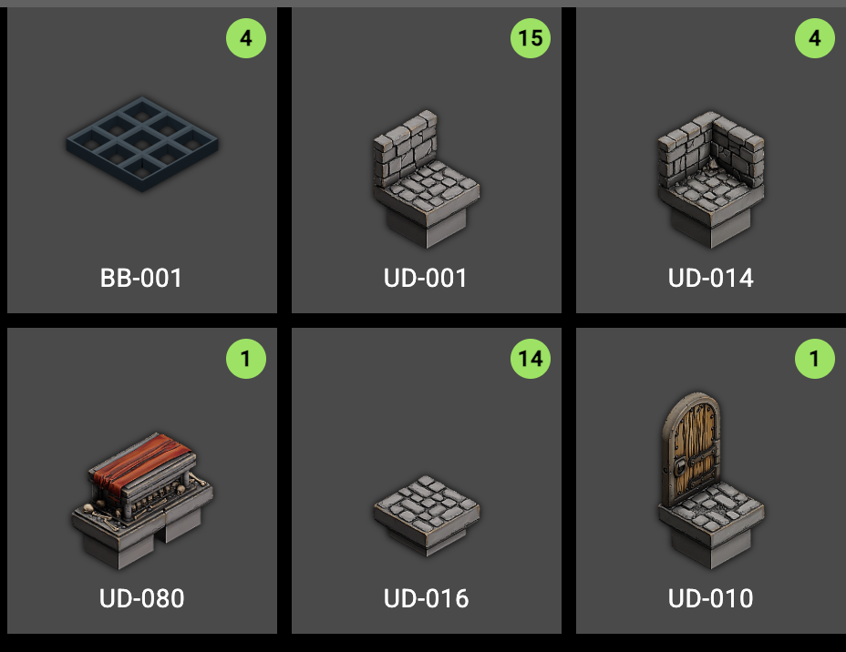

This was my take on the module [The Delian Tomb](https://homebrewery.naturalcrit.com/share/OJ7dSUf9SJ9N).  I found it on 
[Advent's Amazing Advice](https://www.patreon.com/cw/AdventsAmazingAdvice)'s patreon.  There's also a [GM Binder version](https://www.gmbinder.com/share/-LZa_80ondsqXra1TQIy) (which is where I derived my map from).  

This build uses [THE ULTIMATE DUNGEON](https://www.myminifactory.com/object/3d-print-the-ultimate-dungeon-dungeon-blocks-299141) 

Couple of design choices - I made each room 6x6 and I made them into separate maps.  I would set up each room in succession on the table, but would not have them connected together.  The map would get quite large if you did them as a single map.  It wouldn't be too difficult to add the passages between the rooms that are drawn on the map.  The "secret" side of secret doors are normal walls.  If they found the secret I would just remove the wall tile and replace it with a floor tile.

The entrance - I uses some scatter terrain barrels and boxes to give the goblins something to shoot arrows from behind.

Build list:

The Offering Room - I had other scatter terrain peices to augment this room.

Build list:

The Hall of the Oath Keeper - I took a piece of floor and turn it upside down and put a paladin mini on it to be the statue.  I had scatter terrain for the rest.

Build list:

The Tomb - I used one Dungeon Block to look like the main sarcophagus and some other scatter terrain coffins to reperesent the other ones.

Build list:
