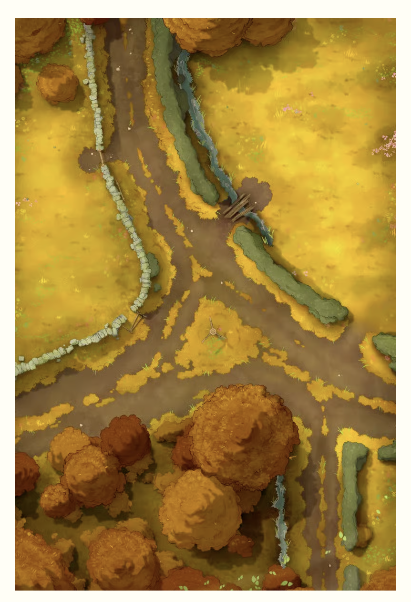
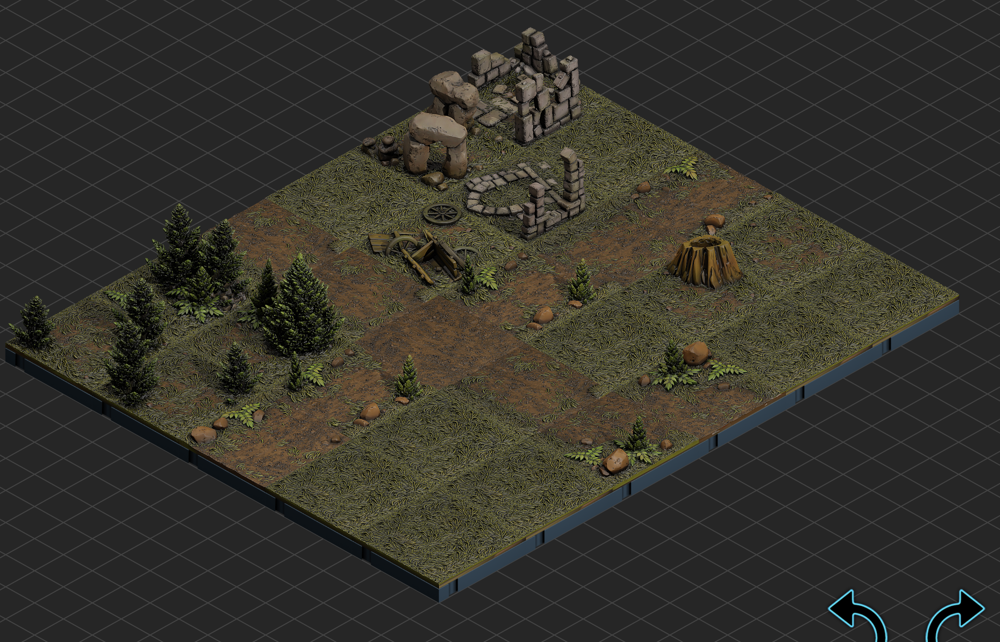

This was my take on the random encounter Goblin Ambush at the Crossroads.  I found it on Encounter Vault - [https://encountervault.com/](https://encountervault.com/) (this seems to be offline last I checked June 6 2026)

The specific encounter - [Goblin Ambush at the Crossroads](https://encountervault.com/encounter/combat/forest/goblin-ambush-at-the-crossroads) is a combat encounter - goblins are hiding in the trees and bushes to ambush the party.

It uses the [Dungeon Blocks XL - Majestic Highlands
](https://www.myminifactory.com/frontier/dungeon-blocks-xl-majestic-highlands-4187) tile set.  
Source Map:

layout

